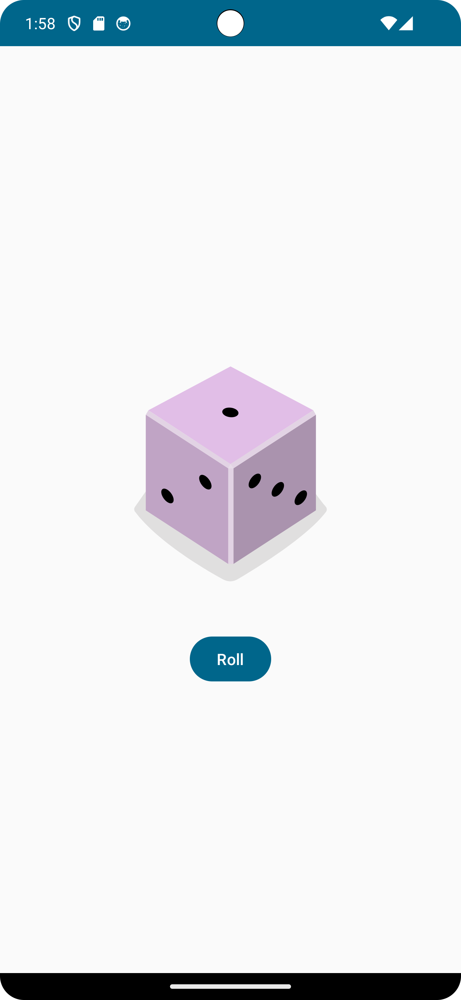

# Android-Dice-Roller

A Kotlin-based Android application that allows users to roll dice with their Android mobile devices.
Credit: [Android Basics with Compose: Unit 2](https://developer.android.com/courses/android-basics-compose/unit-2)

## Version

- IDE Version: Android Studio Giraffe | 2022.3.1 Patch 1  
- JDK Version: OpenJDK 20.0.2  
- Gradle Version: 8.0  
- Android Gradle Plugin Version: 8.1.1  

## Screenshots

